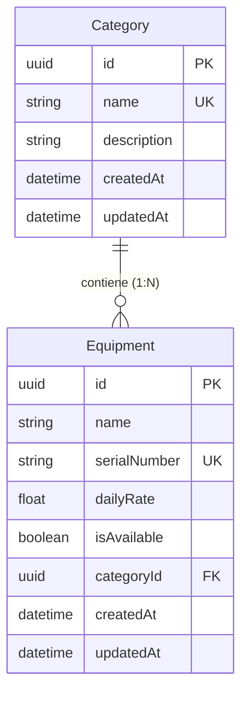

# 🎧 Proyecto Semana 05 — API con PostgreSQL y Prisma ORM
## Dominio: DJ / Sonido y Luces (Equipment & Category API)

API REST profesional desarrollada con **Express.js**, **TypeScript**, **PostgreSQL** y **Prisma ORM** para la **Semana 05** del Bootcamp. Implementa arquitectura en capas, validación con **Zod**, manejo estructurado de errores con **AppError**, logging con **Winston + Morgan**, migraciones versionadas y semillas de datos demo (**seed**).

---

## 📌 1. Información del Dominio

* **Dominio Asignado:** DJ / Sonido y Luces
* **Recurso Principal:** `Equipment` (`/api/v1/equipment` o `/api/v1/items`)
* **Recurso Secundario (Relación 1:N):** `Category`
* **Regla del Bootcamp:** Todas las Claves Primarias (`PK`) y Claves Foráneas (`FK`) se definen estrictamente en formato **UUID** (`String @id @default(uuid()) @db.Uuid`).

---

## 📐 2. Diagrama Entidad-Relación (ER)



---

## 🛠️ 3. Estructura de Modelos en Prisma (`prisma/schema.prisma`)

```prisma
model Category {
  id          String      @id @default(uuid()) @db.Uuid
  name        String      @unique
  description String?
  equipments  Equipment[]
  createdAt   DateTime    @default(now())
  updatedAt   DateTime    @updatedAt
}

model Equipment {
  id           String   @id @default(uuid()) @db.Uuid
  name         String
  serialNumber String   @unique
  dailyRate    Float
  isAvailable  Boolean  @default(true)
  category     Category @relation(fields: [categoryId], references: [id], onDelete: Cascade)
  categoryId   String   @db.Uuid
  createdAt    DateTime @default(now())
  updatedAt    DateTime @updatedAt
}
```

---

## 🚀 4. Instalación y Ejecución

### Requisitos Previos
* Node.js >= 22.0.0
* pnpm >= 10.0.0
* Docker y Docker Compose (o PostgreSQL 16 local)

### Pasos de Inicio Rápido

1. **Instalar dependencias**:
   ```bash
   pnpm install
   ```

2. **Levantar PostgreSQL con Docker**:
   ```bash
   docker compose up -d
   ```

3. **Configurar variables de entorno**:
   ```bash
   cp .env.example .env
   ```

4. **Ejecutar migraciones de Prisma**:
   ```bash
   pnpm dlx prisma migrate dev --name init
   ```

5. **Ejecutar Seed de datos iniciales**:
   ```bash
   pnpm dlx prisma db seed
   ```

6. **Iniciar servidor en modo desarrollo**:
   ```bash
   pnpm dev
   ```
   *Servidor escuchando en:* `http://localhost:3000`

---

## 📜 5. Logs de Ejecución del Seed (`pnpm dlx prisma db seed`)

```text
> proyecto-semana-05@1.0.0 db:seed
> prisma db seed

Running seed command `tsx prisma/seed.ts` ...
🌱 Iniciando seed de datos para DJ / Sonido y Luces...
  [Category] Upserted: "DJ Gear"
  [Category] Upserted: "Sonido Profesional"
  [Category] Upserted: "Iluminación y Láser"
  [Category] Upserted: "Efectos Especiales"
  [Equipment] Upserted: "Consola DJ Pioneer DDJ-FLX6-GT" (SN: DJ-PIONEER-FLX6-001)
  [Equipment] Upserted: "Bafle Amplificado JBL EON715 1300W" (SN: SND-JBL-EON715-002)
  [Equipment] Upserted: "Cabeza Móvil LED Beam 230W RGBW" (SN: LGT-BEAM-230W-003)
  [Equipment] Upserted: "Máquina de Humo Chauvet Hurricane 1200" (SN: EFF-CHAUVET-1200-004)
  [Equipment] Upserted: "Altavoz Activo QSC K12.2 2000W" (SN: SND-QSC-K122-005)
  [Equipment] Upserted: "Foco Par LED 18x12W RGBW DMX" (SN: LGT-PARLED-18X12-006)
✅ Seed completado exitosamente.
```

---

## 🌐 6. Endpoints de la API REST

### Recurso Principal: `/api/v1/equipment` (Alias compatibilidad: `/api/v1/items`)

| Método | Ruta | Descripción | Estado HTTP |
| :--- | :--- | :--- | :--- |
| `GET` | `/api/v1/equipment?page=1&limit=10` | Obtener equipos paginados con PostgreSQL | `200 OK` |
| `GET` | `/api/v1/equipment/:id` | Obtener detalle de equipo por UUID (incluye categoría) | `200 OK` / `404 Not Found` |
| `POST` | `/api/v1/equipment` | Crear equipo (validación Zod) | `201 Created` / `400` / `409` |
| `PUT` | `/api/v1/equipment/:id` | Actualizar equipo parcial/total | `200 OK` / `400` / `404` / `409` |
| `DELETE` | `/api/v1/equipment/:id` | Eliminar equipo por UUID | `204 No Content` / `404` |

---

## 📸 7. Ejemplos de Request / Response

### 1. GET `/api/v1/equipment?page=1&limit=2`
**Response (200 OK):**
```json
{
  "data": [
    {
      "id": "e9b2a1f4-7c3d-4e8a-9f1b-2c3d4e5f6a7b",
      "name": "Consola DJ Pioneer DDJ-FLX6-GT",
      "serialNumber": "DJ-PIONEER-FLX6-001",
      "dailyRate": 45,
      "isAvailable": true,
      "categoryId": "a1b2c3d4-e5f6-7a8b-9c0d-1e2f3a4b5c6d",
      "createdAt": "2026-08-31T17:00:00.000Z",
      "updatedAt": "2026-08-31T17:00:00.000Z",
      "category": {
        "id": "a1b2c3d4-e5f6-7a8b-9c0d-1e2f3a4b5c6d",
        "name": "DJ Gear",
        "description": "Consolas, controladores y reproductores para DJ profesional",
        "createdAt": "2026-08-31T17:00:00.000Z",
        "updatedAt": "2026-08-31T17:00:00.000Z"
      }
    }
  ],
  "total": 6,
  "page": 1,
  "limit": 2
}
```

### 2. POST `/api/v1/equipment`
**Request Body:**
```json
{
  "name": "Sistema Line Array RCF HDL 20-A",
  "serialNumber": "SND-RCF-HDL20-007",
  "dailyRate": 120.0,
  "isAvailable": true,
  "categoryId": "a1b2c3d4-e5f6-7a8b-9c0d-1e2f3a4b5c6d"
}
```
**Response (201 Created):**
```json
{
  "data": {
    "id": "f8a9b0c1-d2e3-4f5a-6b7c-8d9e0f1a2b3c",
    "name": "Sistema Line Array RCF HDL 20-A",
    "serialNumber": "SND-RCF-HDL20-007",
    "dailyRate": 120,
    "isAvailable": true,
    "categoryId": "a1b2c3d4-e5f6-7a8b-9c0d-1e2f3a4b5c6d",
    "createdAt": "2026-08-31T17:15:00.000Z",
    "updatedAt": "2026-08-31T17:15:00.000Z",
    "category": {
      "id": "a1b2c3d4-e5f6-7a8b-9c0d-1e2f3a4b5c6d",
      "name": "Sonido Profesional",
      "description": "Bafles amplificados, subwoofers y sistemas Line Array"
    }
  }
}
```

---

## 💥 8. Manejo de Errores de Prisma

| Código Prisma | Causa | Mapeo HTTP | Respuesta JSON |
| :--- | :--- | :--- | :--- |
| **`P2025`** | Registro no encontrado al intentar `findUnique`, `update` o `delete`. | `404 Not Found` | `{ "error": "Not Found", "message": "Recurso no encontrado" }` |
| **`P2002`** | Violación de restricción única (`@unique`), ej. `serialNumber` repetido. | `409 Conflict` | `{ "error": "Conflict", "message": "Ya existe un registro con ese valor" }` |
